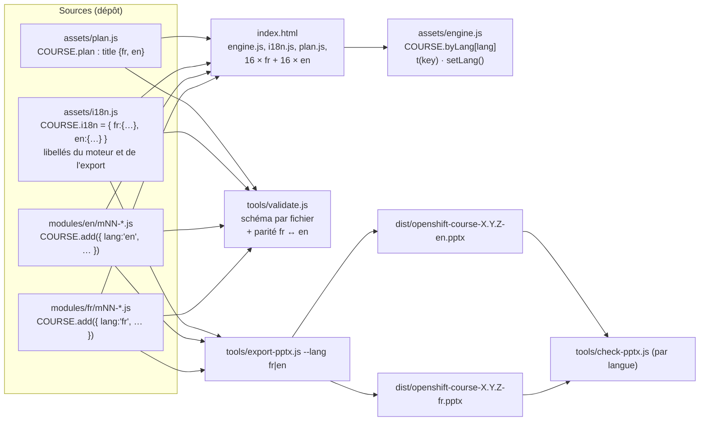

---
mockup:
  composant: course_content
  feature: i18n_layout
  version: 1.0.0
  type: architecture
  issue: "#3"
  validee_le: 2026-10-07
  complete: []
  remplace: []
---

# Contenu du cours bilingue : fichiers, chargement, outils

Option recommandée (plan `_work/reports/planner-i18n.md`, décision Q1) : un fichier par module et par langue,
structure identique imposée par `tools/validate.js`.

## Arborescence et consommateurs



## Choix de la langue au chargement et au changement

```mermaid
stateDiagram-v2
  [*] --> Resolve
  Resolve --> FromURL: ?lang=fr|en valide
  Resolve --> FromStore: sinon state.lang mémorisé
  Resolve --> FromBrowser: sinon navigator.languages commence par fr ou en
  Resolve --> Default: sinon
  FromURL --> Ready
  FromStore --> Ready
  FromBrowser --> Ready
  Default --> Ready: fr (Q2)
  Ready --> Switching: clic FR/EN ou touche l
  Switching --> Ready: save state.lang · html lang · ?lang= (replaceState, try/catch) · build(lang) · show(même uid, mêmes fragments) · annonce
```

## Repli pendant la traduction (branche feature/i18n)

Module absent en `en` : le moteur affiche le module `fr` avec le bandeau « Not translated yet — showing French ».
`node tools/validate.js` : avertissement ; `node tools/validate.js --strict-i18n` (PR vers main et release) : erreur.
